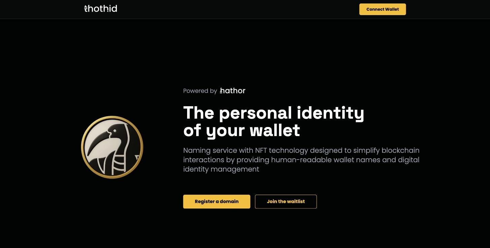
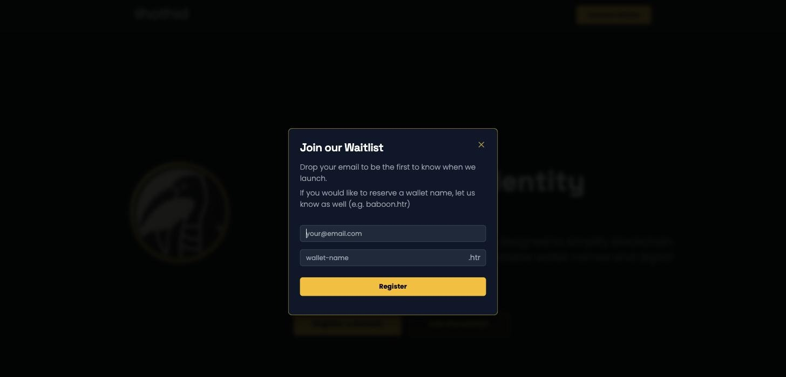

# Web App


**Project status: testnet**

The thoth.id web app currently runs against the **Hathor testnet**. Names you register, fees you pay and NFTs you receive are testnet assets. Screenshots in this section were taken on the testnet build.


The thoth.id web app is where you search for a name, register it, and manage everything attached to it — your avatar, your records, who controls the name, and when it expires.

This section is the **user guide**. If you are a developer looking to read thoth.id data from your own application, see the [SDK Reference](sdk-reference.md) instead.

## What you can do

<table data-view="cards"><thead><tr><th></th><th></th><th data-hidden data-card-target data-type="content-ref"></th><th data-hidden data-card-cover data-type="image">Cover image</th></tr></thead><tbody><tr><td><strong>Register Your First Name</strong></td><td>Get started: register a name end to end.</td><td><a href="web-app/quickstart.md">quickstart.md</a></td><td><a href=".gitbook/assets/landing-hero.jpg">landing-hero.jpg</a></td></tr><tr><td><strong>Connect Your Wallet</strong></td><td>Link your Hathor wallet through WalletConnect.</td><td><a href="web-app/connect-wallet.md">connect-wallet.md</a></td><td><a href=".gitbook/assets/connect-wallet-modal.jpg">connect-wallet-modal.jpg</a></td></tr><tr><td><strong>Search for a Name</strong></td><td>Find out whether a name is free.</td><td><a href="web-app/search.md">search.md</a></td><td><a href=".gitbook/assets/search-available.jpg">search-available.jpg</a></td></tr><tr><td><strong>Register a Domain</strong></td><td>Choose a term, add an avatar and register.</td><td><a href="web-app/register.md">register.md</a></td><td><a href=".gitbook/assets/register-page.jpg">register-page.jpg</a></td></tr><tr><td><strong>Your Dashboard</strong></td><td>See every name you control.</td><td><a href="web-app/dashboard.md">dashboard.md</a></td><td><a href=".gitbook/assets/dashboard.jpg">dashboard.jpg</a></td></tr><tr><td><strong>The Domain Page</strong></td><td>Inspect or edit a single name.</td><td><a href="web-app/domain-page.md">domain-page.md</a></td><td><a href=".gitbook/assets/domain-profile.jpg">domain-profile.jpg</a></td></tr><tr><td><strong>Renew a Domain</strong></td><td>Add years before a name expires.</td><td><a href="web-app/renew.md">renew.md</a></td><td><a href=".gitbook/assets/extend-dialog.jpg">extend-dialog.jpg</a></td></tr><tr><td><strong>Transactions &#x26; Notifications</strong></td><td>Follow a transaction to confirmation.</td><td><a href="web-app/notifications.md">notifications.md</a></td><td><a href=".gitbook/assets/notifications.jpg">notifications.jpg</a></td></tr><tr><td><strong>Naming Rules &#x26; Fees</strong></td><td>Which names are allowed and what they cost.</td><td><a href="web-app/naming-rules-and-fees.md">naming-rules-and-fees.md</a></td><td><a href=".gitbook/assets/search-not-supported.jpg">search-not-supported.jpg</a></td></tr><tr><td><strong>Troubleshooting</strong></td><td>Fix common wallet and transaction problems.</td><td><a href="web-app/troubleshooting.md">troubleshooting.md</a></td><td><a href=".gitbook/assets/account-menu.jpg">account-menu.jpg</a></td></tr></tbody></table>

## How it works, in one paragraph

Every thoth.id name is a **nano contract entry on the Hathor Network**, and registering one also mints an **NFT token** that represents it. The web app never holds your keys and never stores your names — it reads the contract through the [thoth.id SDK](sdk-reference.md), and every change you make is a transaction that **you sign in your own wallet**. Nothing changes until that transaction confirms on-chain.

The one exception is avatar images. An image is too big to live on-chain, so the app uploads it to blob storage and writes only the resulting **URL** into your on-chain profile.

## Before you start

You need:

* A **Hathor wallet** that supports WalletConnect — the mobile app, or the desktop wallet.
* Some **HTR** in that wallet to pay the registration fee and, later, renewals.

That's it. There is no thoth.id account, no password, and no sign-up. Your wallet _is_ your identity.

## Not ready to register?

The landing page has a **Join the waitlist** button. Leave your email — and optionally the name you'd like to reserve — and you'll hear from the team at launch.

