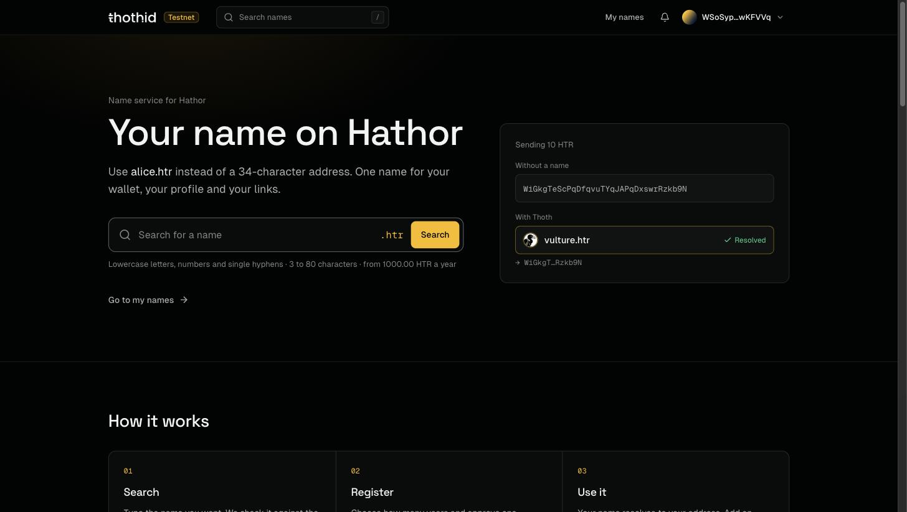

# Web App


**Project status: testnet**

The thoth.id web app currently runs against the **Hathor testnet**. Names you register, fees you pay and tokens you receive are testnet assets, and testnet names don't carry over to mainnet. Screenshots in this section were taken on the testnet build, which is why they show a **Testnet** label next to the logo.


The thoth.id web app is where you search for a name, register it, and manage everything attached to it: your avatar and bio, your links, the address the name points to, who controls it, and when it expires.

This section is the **user guide**. If you are a developer looking to read thoth.id data from your own application, see the [SDK Reference](sdk-reference.md) instead.

## What you can do

<table data-view="cards"><thead><tr><th></th><th></th><th data-hidden data-card-target data-type="content-ref"></th><th data-hidden data-card-cover data-type="image">Cover image</th></tr></thead><tbody><tr><td><strong>Register Your First Name</strong></td><td>Get started: register a name end to end.</td><td><a href="web-app/quickstart.md">quickstart.md</a></td><td><a href=".gitbook/assets/landing-hero.jpg">landing-hero.jpg</a></td></tr><tr><td><strong>Connect Your Wallet</strong></td><td>Link Hathor Wallet through WalletConnect.</td><td><a href="web-app/connect-wallet.md">connect-wallet.md</a></td><td><a href=".gitbook/assets/connect-wallet-modal.jpg">connect-wallet-modal.jpg</a></td></tr><tr><td><strong>Search for a Name</strong></td><td>Find out whether a name is free and what it costs.</td><td><a href="web-app/search.md">search.md</a></td><td><a href=".gitbook/assets/search-available.jpg">search-available.jpg</a></td></tr><tr><td><strong>Register a Name</strong></td><td>Choose a term, add an avatar and register.</td><td><a href="web-app/register.md">register.md</a></td><td><a href=".gitbook/assets/register-page.jpg">register-page.jpg</a></td></tr><tr><td><strong>My Names</strong></td><td>See every name you manage.</td><td><a href="web-app/dashboard.md">dashboard.md</a></td><td><a href=".gitbook/assets/my-names.jpg">my-names.jpg</a></td></tr><tr><td><strong>The Name Page</strong></td><td>The public page of a name, and Manage mode.</td><td><a href="web-app/domain-page.md">domain-page.md</a></td><td><a href=".gitbook/assets/name-public.jpg">name-public.jpg</a></td></tr><tr><td><strong>Renew a Name</strong></td><td>Add years before a name expires.</td><td><a href="web-app/renew.md">renew.md</a></td><td><a href=".gitbook/assets/renew-dialog.jpg">renew-dialog.jpg</a></td></tr><tr><td><strong>Transactions &#x26; Activity</strong></td><td>Follow a transaction to confirmation.</td><td><a href="web-app/notifications.md">notifications.md</a></td><td><a href=".gitbook/assets/activity.jpg">activity.jpg</a></td></tr><tr><td><strong>Naming Rules &#x26; Fees</strong></td><td>Which names are allowed and what they cost.</td><td><a href="web-app/naming-rules-and-fees.md">naming-rules-and-fees.md</a></td><td><a href=".gitbook/assets/search-not-supported.jpg">search-not-supported.jpg</a></td></tr></tbody></table>

## How it works, in one paragraph

Every thoth.id name is an **entry in a nano contract on the Hathor Network**, and registering one also mints a **token** (an NFT) that represents it. The web app never holds your keys and never stores your names. It reads the contract through the [thoth.id SDK](sdk-reference.md), and every change you make is a transaction that **you approve in Hathor Wallet**. Nothing changes until that transaction confirms on-chain, usually in about 30 seconds. There are no network fees on Hathor; you only pay the name's price.

The one exception is avatar images. An image is too big to live on-chain, so the app uploads it to blob storage and writes only the resulting **URL** into your on-chain profile.

## Before you start

You need:

* **Hathor Wallet** with WalletConnect support: the mobile app or the desktop wallet.
* Some **HTR** in that wallet to pay for the name and, later, renewals.

That's it. There is no thoth.id account, no password, and no sign-up. Your wallet _is_ your identity.

You don't need a wallet to look around: searching, and viewing any name's public page, work without one.


Stuck? See [troubleshooting.md](web-app/troubleshooting.md "mention").

