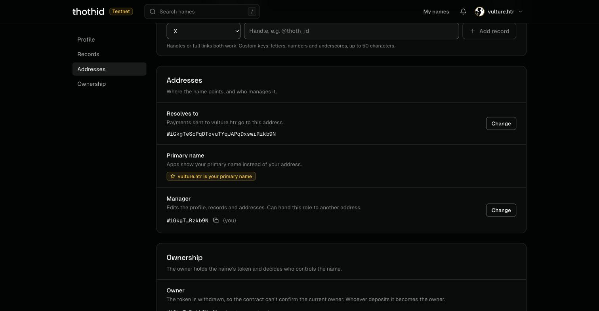
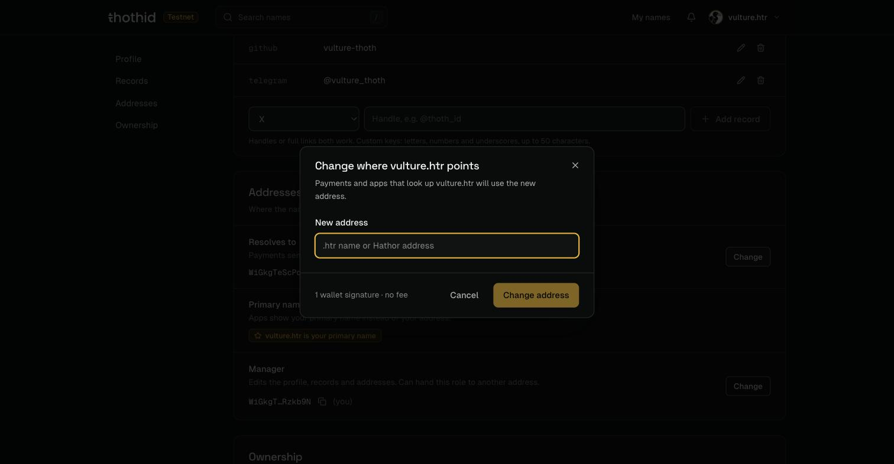
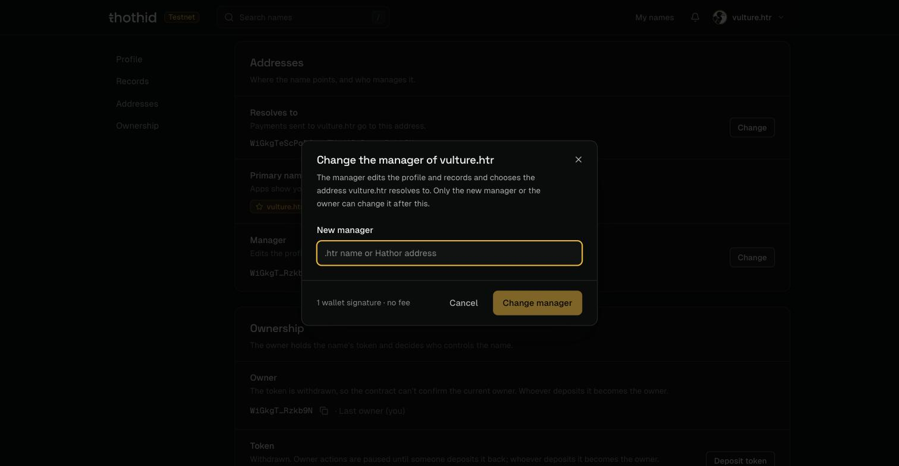

# Addresses

The **Addresses** section of [Manage mode](domain-page.md#manage-mode) controls where the name points and who manages it.

## Resolves to

The address that payments sent to `yourname.htr` go to. This is what wallets and apps get back when they look the name up, and what [`resolveName`](../sdk-reference/resolveName.md) returns for everyone using the SDK.

Only the **manager** can change it. Click **Change**, enter the new address, and click **Change address**. One wallet signature, no fee.

## Primary name

A wallet can manage many names, but only one is its **primary name**: the one thoth.id shows instead of your address, in the top bar and to anyone looking up your address.

The **first** name you register becomes your primary name automatically. After that, open the name you want in Manage mode and click **Set as primary name**. There's no confirmation dialog; approve it in Hathor Wallet and it takes effect once it confirms.

Setting a new primary name replaces the old one. There is only ever one per address.

## Manager

The manager edits the profile, records and the address the name resolves to, and can hand the role to another address.

Click **Change**, enter the new manager, and click **Change manager**. One wallet signature, no fee.

| Who can change the manager | When                                    |
| -------------------------- | --------------------------------------- |
| The current **manager**    | Always                                  |
| The **owner**              | While the name's token is deposited     |

If you're the manager but not the owner, handing the role on means you can't take it back: only the new manager or the owner can change it after that.

## Entering an address

Every address field accepts either an address or a **.htr name**:

* Type a name and the app shows the address it resolves to. The change goes to **that address**, not to the name, so it won't follow the name if it later points somewhere else.
* Type an address and the app shows its primary name, if it has one.
* Entering the current value says _Nothing would change._ and keeps the button disabled.
* Addresses from another network are rejected.

Still, a valid address that isn't the one you meant will be accepted, so check it before you approve.
