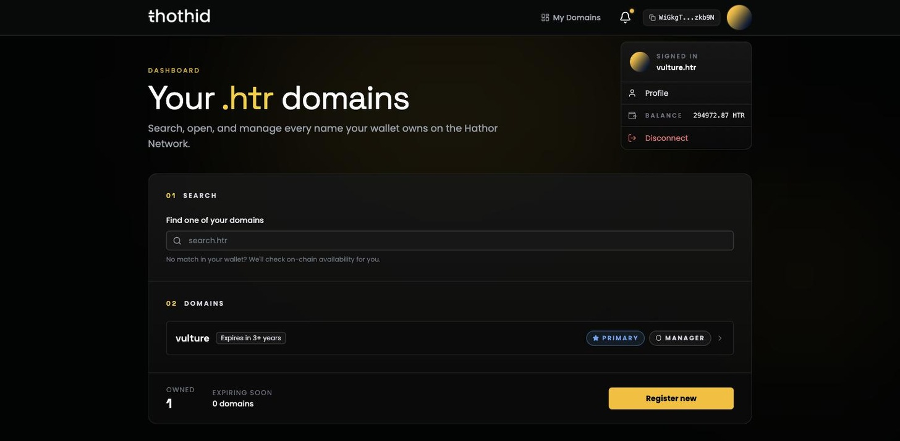

# Connect Your Wallet 🔐

Your wallet is your thoth.id account. You can browse and search without one, but registering a name — or changing anything about a name you already hold — requires a connected wallet.

## What you need

* The **Hathor Wallet** mobile app, or the Hathor desktop wallet.
* WalletConnect support (built into both).
* Enough **HTR** to cover the fee of whatever you're about to do.

## Connecting on desktop

1. Click **Connect Wallet** in the top-right corner of any page.
2. A WalletConnect dialog opens with a QR code.
3. Open your Hathor wallet, choose to scan a WalletConnect QR code, and point it at the screen.
4. Approve the session request in the wallet.

You can also press the copy icon next to **Connect your wallet** to copy the pairing URI and paste it into a wallet on the same machine.

## Connecting on mobile

On a phone or tablet, **Connect Wallet** skips the QR code and deep-links straight into the Hathor Wallet app. If the app isn't installed, you're sent to the App Store or Google Play instead.

## What you are approving

The session asks your wallet for permission to request three things:

| Permission | Used for |
| --- | --- |
| `htr_signWithAddress` | Proving which address you control |
| `htr_sendNanoContractTx` | Every registration, renewal, record change and role change |
| `htr_createToken` | Minting the NFT that represents your name |

Granting the session does **not** authorise any spending on its own. Every single transaction is pushed back to your wallet for you to review and approve individually. If you dismiss it there, nothing happens on-chain.

## Once you're connected

The top bar changes to show:

* **My Domains** — a shortcut to your [dashboard](dashboard.md).
* **🔔 Notifications** — the status of your in-flight transactions. See [Transactions & Notifications](notifications.md).
* **Your address**, truncated. Click it to copy the full address to your clipboard.
* **Your avatar**, which opens a menu containing your primary name, a link to its profile, your HTR balance, and **Disconnect**.

If you have set a [primary name](profile.md#set-a-primary-name), the app shows that name and its avatar everywhere instead of a raw address.

## Sessions and disconnecting

The session survives page reloads and browser restarts — you generally connect once and stay connected. To end it, open the avatar menu and choose **Disconnect**. You can also revoke the session from inside your wallet.

Two redirects are worth knowing about:

* Opening **/dashboard** while disconnected sends you back to the landing page.
* Opening the **landing page** while connected sends you to the search page.

## Network

The app is currently pinned to the **Hathor testnet** (`hathor:testnet`). Make sure your wallet is on the testnet too, otherwise the session request will fail to match.
