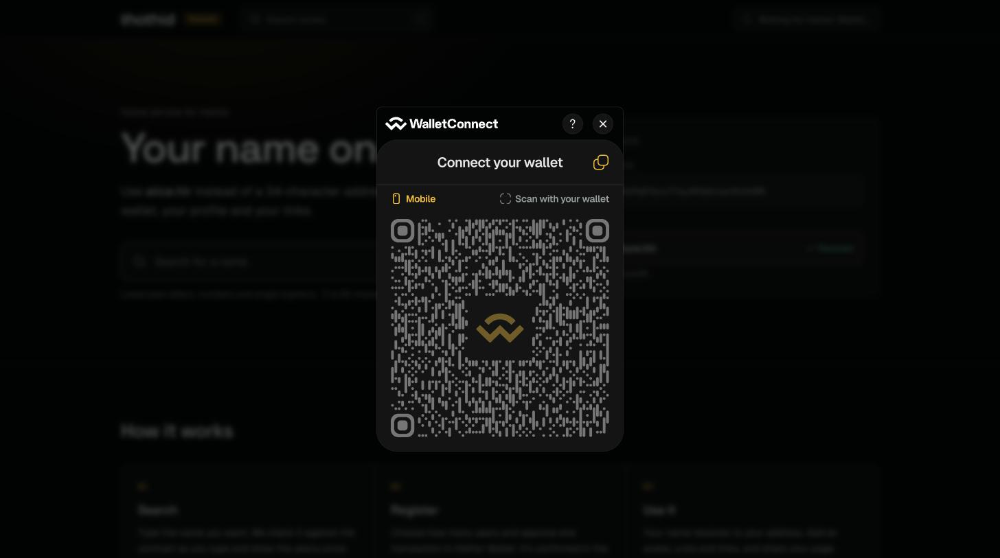
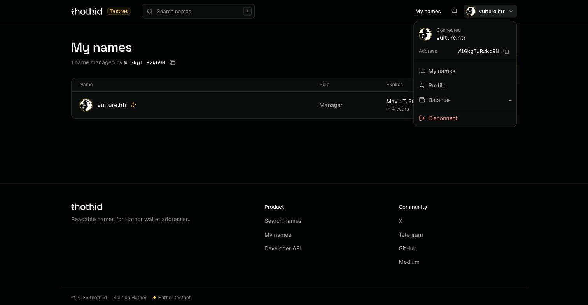

# Connect Your Wallet

Your wallet is your thoth.id account. You can search and view any name's page without one, but registering a name, or changing anything about a name you hold, needs a connected wallet.

## What you need

* The **Hathor Wallet** mobile app, or the Hathor desktop wallet.
* WalletConnect support (built into both).
* Enough **HTR** to cover whatever you're about to do.

## Connecting on desktop

1. Click **Connect wallet** in the top-right corner of any page.
2. A WalletConnect dialog opens with a QR code.
3. Open Hathor Wallet, choose to scan a WalletConnect QR code, and point it at the screen.
4. Approve the session request in the wallet.

While the app waits for your approval, the button reads **Waiting for Hathor Wallet…**.

You can also press the copy icon next to **Connect your wallet** to copy the pairing link and paste it into a wallet on the same machine.

## Connecting on mobile

On a phone or tablet, **Connect wallet** skips the QR code and opens the Hathor Wallet app directly. If the app isn't installed, you're sent to the App Store or Google Play instead.

## What you are approving

Connecting only shares your address. The session asks your wallet for permission to _request_ three things:

| Permission               | Used for                                                       |
| ------------------------ | -------------------------------------------------------------- |
| `htr_signWithAddress`    | Proving which address you control                              |
| `htr_sendNanoContractTx` | Every registration, renewal, profile, record and role change   |
| `htr_createToken`        | Minting the token that represents your name                    |

Granting the session does **not** authorise any spending on its own. Every transaction comes back to Hathor Wallet for you to review and approve individually. If you refuse it there, nothing happens on-chain.

## Once you're connected

The top bar changes to show:

* **My names**: a shortcut to [the list of names you manage](dashboard.md). On a phone it's inside the account menu.
* **The bell**: your transactions in progress and recent results. See [Transactions & Activity](notifications.md).
* **Your account**: your avatar and your [primary name](addresses.md#primary-name), or your shortened address if you don't have one.

Click your account to open the menu. It shows your address with a copy button, links to **My names** and your **Profile** (the page of your primary name), your HTR **Balance**, and **Disconnect**.

## Sessions and disconnecting

The session survives page reloads and browser restarts, so you generally connect once and stay connected. To end it, open the account menu and choose **Disconnect**. You can also end the session from inside your wallet.

If a request is still waiting in Hathor Wallet, or a follow-up signature hasn't been sent yet (for example the avatar after a registration), **Disconnect** asks first. It lists what would be lost and lets you **Stay connected** instead. Transactions that are already confirming are not affected: the app keeps following them after you disconnect.

## Network

The testnet app only works with a wallet on the **Hathor testnet**. If your wallet is on another network, the session request won't match.
