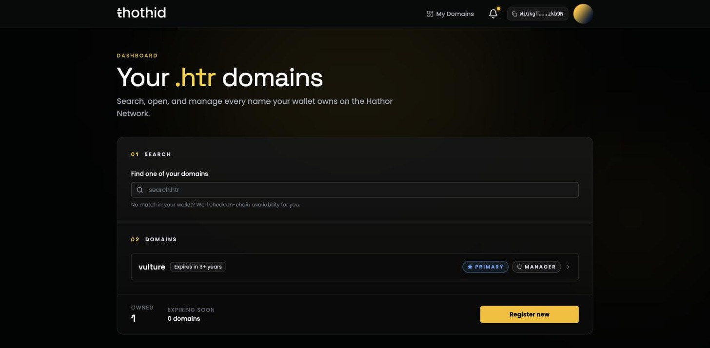

# Your Dashboard 📋

The dashboard is the list of every name you currently **manage**. Reach it from **My Domains** in the top bar, or at **/dashboard**.

It requires a connected wallet — opening it while disconnected sends you back to the landing page.

## 01 · Search

The search box filters the names you already hold as you type.

If nothing in your list matches, the app checks that name **on-chain** instead and shows you a single global result — *Available*, *Registered* or *Not supported*, exactly like the [search page](search.md). Click it to register the name or to open its domain page.

That makes the box a quick way to check any name without leaving the dashboard.

## 02 · Domains

Each row is one name you manage. Click a row to open its [domain page](domain-page.md) on the Profile tab.

A row shows:

| Element | Meaning |
| --- | --- |
| **Name** | The name, without the `.htr` suffix |
| **Expiration pill** | How long is left — *Expires in 2 years*, *Expires in 12 days*, or *Expired* |
| **Primary tag** | Shown on the one name set as your [primary name](profile.md#set-a-primary-name) |
| **Manager tag** | Your role on this name |

The expiration pill is colour-coded: grey when there's plenty of time, **yellow** within 30 days of expiry, and **red** once the name has expired.

On narrow screens the tags collapse into icons to save space — tap one to expand it.

If you manage nothing yet, the list reads *You don't own any domains yet.*

## The summary bar

At the bottom:

* **Owned** — how many names you manage.
* **Expiring soon** — how many expire within the next 30 days. A yellow *Renewals due within 30 days* warning appears when that count is above zero.
* **Register new** — takes you to search, carrying whatever you've typed in the search box.

## Manager, not owner

The dashboard lists names where you are the **manager**. On a name you registered yourself, you are both owner and manager, so it makes no difference.

They can differ: if you transfer ownership of a name but stay its manager, it keeps appearing here. If you hand the manager role to somebody else, it disappears from your dashboard even though you may still own the NFT. See [Ownership & Roles](ownership.md) for what each role can do.

## Staying up to date

The list is loaded when the page opens. After a transaction confirms, reload the page to see the new state — the [domain page](domain-page.md) refreshes itself automatically, but the dashboard list does not.
