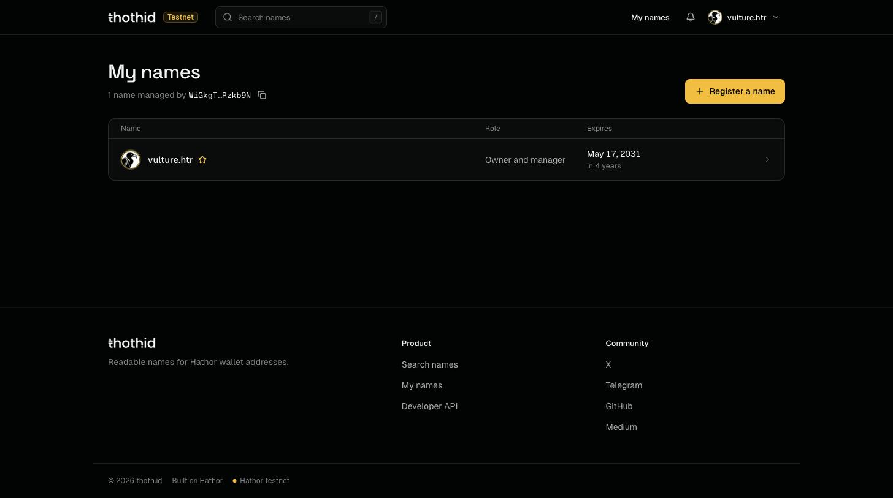

# My Names

**My names** lists every name your wallet **manages**. Open it from **My names** in the top bar (or the account menu on a phone), or go to **/dashboard**.

If your wallet isn't connected, the page asks you to connect instead of showing the list.

## The list

The header shows how many names your address manages, and a **Register a name** button that takes you to search.

Each row is one name. Click a row to open the name's [page](domain-page.md).

| Column      | Meaning                                                                                              |
| ----------- | ---------------------------------------------------------------------------------------------------- |
| **Name**    | The name and its avatar. A **star** marks your [primary name](addresses.md#primary-name).             |
| **Role**    | **Owner and manager**, or **Manager** if someone else owns it                                         |
| **Expires** | The expiry date and how long is left, for example _in 2 years_                                        |

The expiry turns **yellow** in the last 30 days and **red** once the name has expired. From 30 days before expiry, and through the renewal window, the row gets a **Renew** button. See [Renew a Name](renew.md).

When at least one name needs renewing, a warning at the top says how many, and when an expired name will become available to anyone.

With 5 or more names, a **Filter your names** box appears above the list.

If you don't manage any name yet, the page says _You don't have a .htr name yet_ and offers **Find a name**.

## Changes in progress

The list follows your transactions:

* A registration that's still confirming shows as a dimmed row, **Registering** with a timer.
* A name with a change in flight shows a pill such as **Renewal pending** or **Avatar pending**.

Both disappear on their own when the transaction confirms. If it fails, the row goes back to how it was, and the bell keeps the reason.

## Manager, not owner

The list shows names where you are the **manager**. On a name you registered yourself you're both, so it makes no difference.

They can differ: if you transfer ownership of a name but stay its manager, it keeps appearing here. If you hand the manager role to somebody else, it disappears from your list even if you still own it. See [Ownership](ownership.md) for what each role can do.
