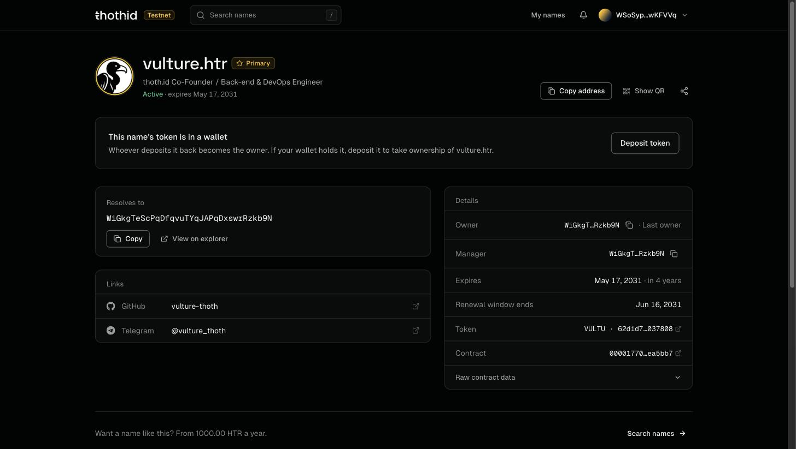
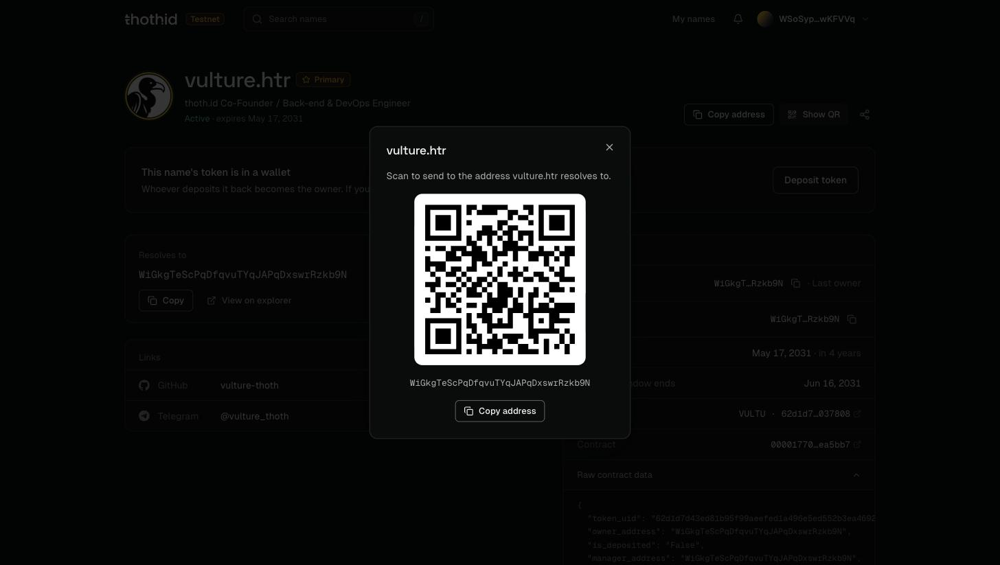
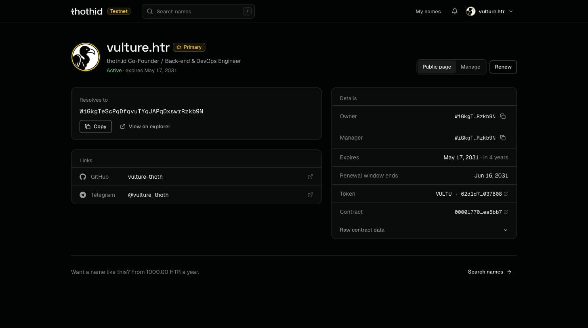
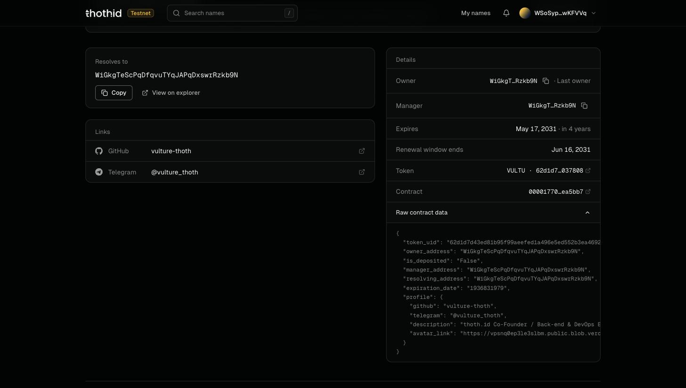
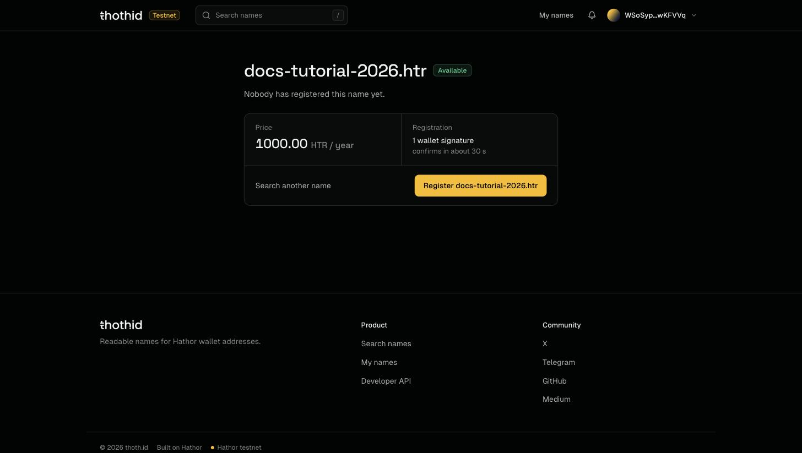

# The Name Page

Every name has a page at **/domain/\<name>.htr**. It is **public**: anyone can open it, with or without a wallet, and see where the name points, its links, who controls it and when it expires. Send the link to anyone who should know your name.

## The header

* The **avatar**, the **name**, and a **Primary** pill if it's its manager's primary name.
* The **bio**, if there is one.
* A status line: **Active**, **Expiring soon** (the last 30 days) or **Expired**, with the expiry date.

On the right, visitors get:

* **Copy address**: copies the address the name resolves to.
* **Show QR**: the same address as a QR code, so someone can scan it to pay you.
* **Share**: shares the page's link, or copies it.

If your connected wallet is the name's **owner or manager**, you get a **Public page | Manage** switch and a **Renew** button instead. See [Manage mode](#manage-mode) below and [Renew a Name](renew.md).

## The panels

**Resolves to.** The full address the name points to, with **Copy** and **View on explorer**. This is the address wallets and apps get when they look the name up. An expired name resolves to nothing until it's renewed.

**Links.** The name's [records](records.md). Known keys (X, GitHub, Telegram, Discord, Website, Email) are shown with their icon and open as links; anything else is listed under **Other records**.

**Details.** Everything else the contract knows about the name:

| Row                     | Meaning                                                                                         |
| ----------------------- | ----------------------------------------------------------------------------------------------- |
| **Owner**               | The [owner](ownership.md). Marked **Last owner** while the token is withdrawn.                  |
| **Manager**             | The [manager](addresses.md#manager)                                                             |
| **Expires**             | The expiry date and how long is left                                                            |
| **Renewal window ends** | The last day the name can be renewed after expiry, before anyone can register it                |
| **Token**               | The name's token symbol and ID, linking to the Hathor explorer                                  |
| **Contract**            | The thoth.id contract, linking to the Hathor explorer                                           |

## Raw contract data

At the bottom of **Details**, **Raw contract data** expands to show the record exactly as the contract returns it, plus the name's profile. It's the quickest way to confirm what's actually stored on-chain, and handy when you're reporting a problem.

| Field               | Meaning                                                                         |
| ------------------- | ------------------------------------------------------------------------------- |
| `token_uid`         | The token minted for this name                                                  |
| `owner_address`     | Current [owner](ownership.md)                                                   |
| `is_deposited`      | `"True"` when the contract holds the token, `"False"` when it's withdrawn       |
| `manager_address`   | Current [manager](addresses.md#manager)                                         |
| `resolving_address` | The address the name resolves to                                                |
| `expiration_date`   | Expiry as a Unix timestamp, in seconds                                          |
| `profile`           | Every [record](records.md), including `avatar_link` and `description`           |

The same record is available to applications through the SDK's [`getNameData`](../sdk-reference/getNameData.md).

## Other states

**Not registered.** The page says _Nobody has registered this name yet_, shows its price, and offers **Register**.

**Expired.** During the renewal window the page shows only the dates, the owner and the renewal price, with a **Renew** button for anyone. Renewing doesn't change the owner.

**Token in a wallet.** When the name's token has been withdrawn, a panel says so and offers **Deposit token**. Whoever deposits it becomes the owner. See [Ownership](ownership.md#deposited-and-withdrawn).

## Manage mode

The owner and the manager edit a name in **Manage mode**, at **/domain/\<name>.htr/manage**. Open it with the **Manage** switch on the name's page.

It has four sections, listed on the left:

| Section                         | What's in it                                                   | Who can edit                   |
| ------------------------------- | -------------------------------------------------------------- | ------------------------------ |
| [**Profile**](profile.md)       | Avatar and bio                                                 | Manager                        |
| [**Records**](records.md)       | Links and other key/value data                                 | Manager                        |
| [**Addresses**](addresses.md)   | Where the name resolves to, the primary name, and the manager  | Manager, and owner for manager |
| [**Ownership**](ownership.md)   | The owner, the name's token, and transferring ownership        | Owner                          |

If you open Manage mode as the owner but not the manager, Profile and Records are read-only and tell you who the manager is. If you're neither, or not connected, the page explains why and links back to the public page.

## Live updates

Every change is a transaction. While one is confirming, the value it changes shows a **Pending** pill and is locked in Manage mode. Once it confirms, the page reloads the name's data by itself, so the new value appears without refreshing the browser. If the transaction fails, the old value simply stays.
