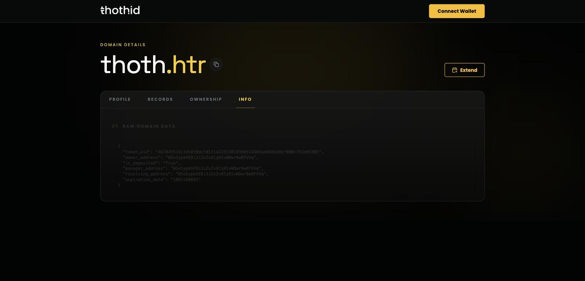

# Info Tab

The Info tab prints the raw contract record for the name, exactly as the nano contract returns it. It's the quickest way to confirm what's actually stored on-chain, and handy when you're reporting a problem.



```json
{
  "token_uid": "dd7845516c345858dcfd131a2255301936651438dae666b38ef000c742e65805",
  "owner_address": "WSoSypkhE8i3iZxZvXCq91vWDwr8wKFVVq",
  "is_deposited": "True",
  "manager_address": "WSoSypkhE8i3iZxZvXCq91vWDwr8wKFVVq",
  "resolving_address": "WSoSypkhE8i3iZxZvXCq91vWDwr8wKFVVq",
  "expiration_date": "1865168691"
}
```

| Field               | Meaning                                                                 |
| ------------------- | ----------------------------------------------------------------------- |
| `token_uid`         | The NFT minted for this name                                            |
| `owner_address`     | Current [owner](ownership.md)                                           |
| `is_deposited`      | `"True"` when the contract holds the NFT, `"False"` when the owner does |
| `manager_address`   | Current [manager](ownership.md)                                         |
| `resolving_address` | The address the name resolves to                                        |
| `expiration_date`   | Expiry as a Unix timestamp, in seconds                                  |

The same record is available to applications through the Sdk's [`getNameData`](../sdk-reference/getNameData.md).

> `expiration_date` is a Unix timestamp — `1865168691` is 7 February 2029. The [Profile](profile.md) and [Ownership](ownership.md) tabs show it as a readable date.
