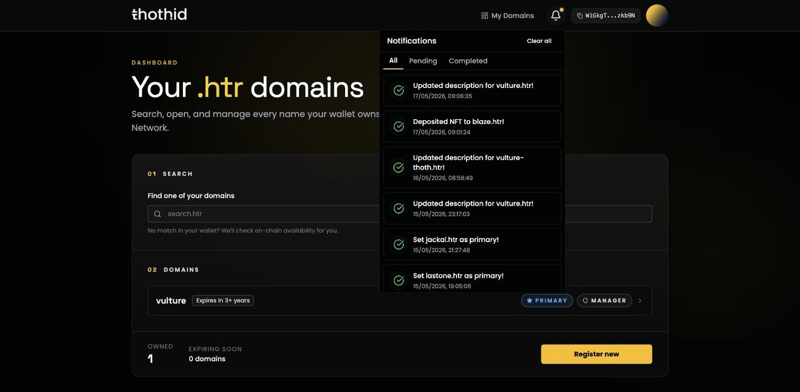

# Transactions & Notifications 🔔

Everything you change in thoth.id is a blockchain transaction, and blockchain transactions take a moment to confirm. The notification centre is where you watch them.

Click the **🔔 bell** in the top bar. It only appears when a wallet is connected. A dot on the bell means there's something you haven't looked at yet.

Each entry shows what happened and when. Click one to see its details, including the transaction hash.

## Statuses

| Status | Meaning |
| --- | --- |
| **Waiting** | Queued behind another transaction, and will start on its own once that one succeeds |
| **Pending** | Submitted to the network, waiting to confirm |
| **Success** | Confirmed on-chain |
| **Failed** | Rejected in your wallet, or failed on-chain |

Notifications are grouped under three tabs — **All**, **Pending** and **Completed** — and **Clear all** empties the list. Clearing is display-only; it never affects anything on-chain.

## How updates arrive

The app polls the Hathor node roughly **every 7 seconds** for each pending transaction and updates the entry as soon as the node reports a result.

The queue is stored in your browser, so it survives a reload — reopen the tab and a pending transaction is still being tracked. It is per-browser, though: a transaction submitted on your laptop won't show up on your phone.

## Chained transactions

Some actions need two steps, and the second can't start until the first has confirmed. The clearest example is [registering a name with an avatar](register.md#if-you-chose-an-avatar):

1. **Registering yourname.htr** — pending.
2. **Waiting to update avatar_link for yourname.htr** — held back.

When step 1 confirms, step 2 starts by itself: the image is uploaded and your wallet asks you to sign the record update. If step 1 fails, step 2 is cancelled and no image is uploaded.

## Toasts

Short-lived messages also appear in the corner as things happen — *Confirm the transaction in your wallet*, *Registration submitted!*, *Failed to update record*. They disappear on their own; the notification centre is the durable record.

## When something fails

A failed entry keeps its error message, and the most common ones are self-explanatory:

* **Transaction was rejected in your wallet** — you dismissed the signature request. Nothing happened; try again.
* **No transaction hash received** — the wallet didn't return a hash. Check the wallet's own history before retrying, in case it went through anyway.
* **Insufficient HTR balance** — top up and retry.

For anything else, see [Troubleshooting](troubleshooting.md).
