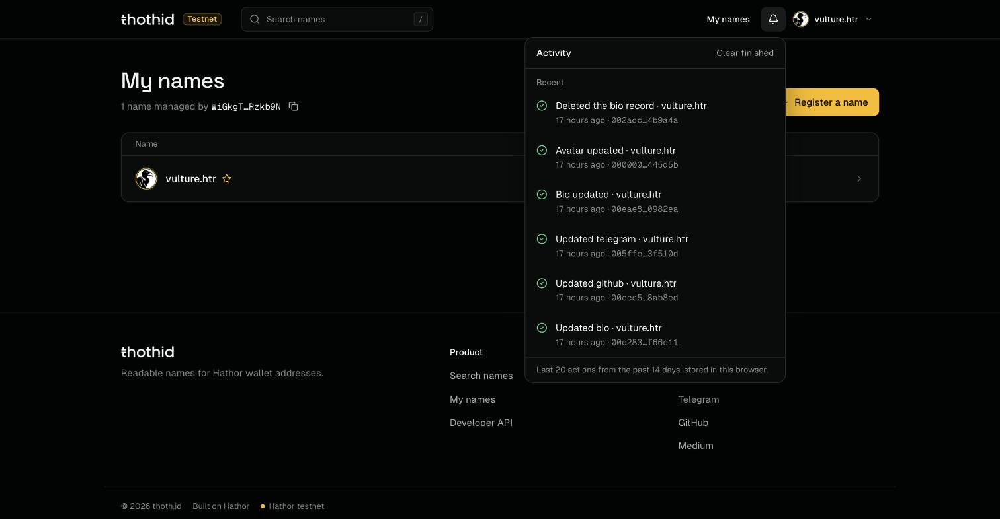

# Transactions & Activity

Everything you change in thoth.id is a blockchain transaction, and each one takes a moment to confirm. The app shows its progress in three places:

* **In the panel** where you started it: the registration page, a Manage section, or a dialog.
* **Under the bell** in the top bar, called **Activity**.
* In a short **toast** in the corner, if you've moved to another page.

## The stages

| Stage                                        | What it means                                                                                              |
| -------------------------------------------- | ---------------------------------------------------------------------------------------------------------- |
| **Approve the request in Hathor Wallet**     | Your wallet is asking. Nothing is sent until you approve.                                                  |
| **Still waiting for Hathor Wallet**          | A minute has gone by. Open the wallet and look for the request. If you approve it later, the app still picks it up while the tab is open. |
| **Confirming**                               | Sent to the network, waiting for a block. Usually about 30 seconds. You can leave the page.                |
| **Taking longer than usual**                 | Still not in a block after 3 minutes. You don't need to do anything; the app keeps checking.               |
| **Confirmed**                                | In a block. The panel says how long it took.                                                               |
| **Failed**                                   | The network rejected it. The reason is shown in plain language, with **Try again**.                        |

A transaction counts as confirmed once it's in its first block.

On a phone, the waiting stages have an **Open Hathor Wallet** button. **Cancel** stops waiting on the page, but the request may still be in your wallet; if you approve it there later, the app picks it up again.

If you refuse the request in Hathor Wallet, the panel just says it was cancelled and nothing was sent.

## Activity

Click the **bell**. It only appears when a wallet is connected. A number on the bell counts transactions in progress; a dot means there are results you haven't seen.

Activity has two groups:

* **In progress**: waiting for your wallet or confirming, with a live timer.
* **Recent**: confirmed and failed transactions from the last 14 days, up to 20.

Click an item to open the name it changed. A failed item opens its reason, with **Try again**. **Clear finished** empties the recent list; it never affects anything on-chain.

The list lives in your browser, so it survives a reload, but a transaction sent from your laptop won't show up on your phone. It only lists transactions from the wallet that's connected now.

## Two signatures

Some actions need a second signature that can only be sent once the first has confirmed:

* A registration with an avatar: the name, then the avatar.
* A profile change with a new bio and a new avatar: the bio, then the avatar.
* A transfer with **Also make them manager**: the transfer, then the manager change.

The app tells you up front (_2 wallet signatures_), and shows **Signature 1 of 2**, **Signature 2 of 2** as it goes. When the first confirms, Hathor Wallet asks for the second automatically, wherever you are in the app.

If you refuse the second request, or it expires, it's recorded as **Not sent**. The first change stays, and you can make the second one again from the name's page. If the first transaction fails, the second is never sent.

## When something fails

Failures say what happened and what was left untouched. The most common:

* **Someone registered yourname.htr first**: another transaction confirmed before yours. Your HTR wasn't spent.
* **Your balance was too low**: add HTR and try again.
* **Your wallet isn't allowed to do this**: only the owner or manager can make that change.
* **The name's token isn't deposited**: owner actions are paused until it's deposited back.
* **Hathor Wallet didn't return a transaction**: check the wallet's history before trying again, in case it went through anyway.

For anything else, see [Troubleshooting](troubleshooting.md).
