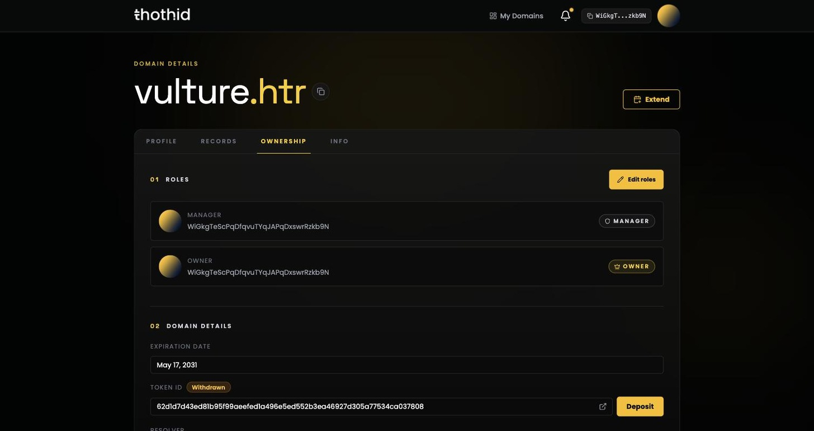
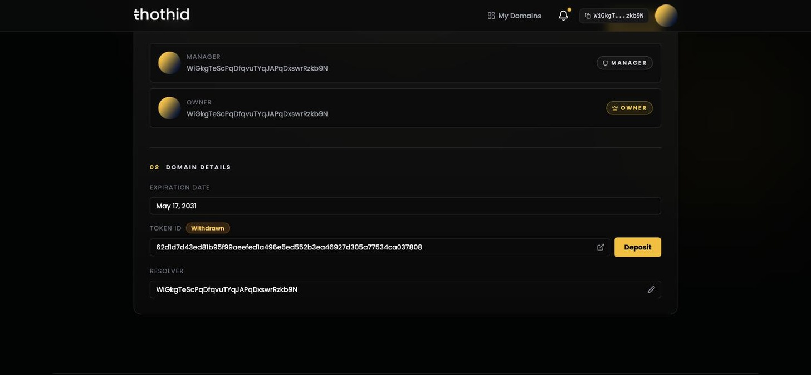
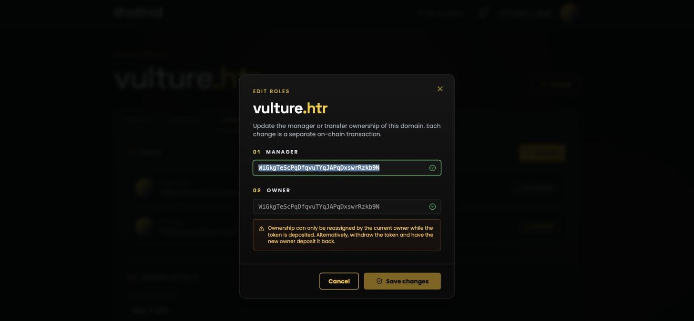

# Ownership & Roles 👑

This tab is where control of a name lives: who owns it, who manages it, where the NFT is, and which address the name resolves to.

## The two roles

| Role | Held by | Can do |
| --- | --- | --- |
| **Owner** | The address that holds the name's NFT | Transfer ownership, change the manager, change the resolver, deposit and withdraw the NFT — plus everything the manager can do |
| **Manager** | The address in charge of day-to-day use | Edit the [profile](profile.md) and [records](records.md), set the name as primary, and hand the manager role to someone else |

When you register a name you get both roles. They only diverge if you deliberately split them — for instance, owning a name yourself while letting a teammate manage its profile.

The name appears on the **[dashboard](dashboard.md)** of whoever is the *manager*.

## Domain details

Below the roles:

* **Expiration date** — when the registration runs out. See [Renew a Domain](renew.md).
* **Token ID** — the NFT that represents the name, with a link to the Hathor explorer and a badge reading **Deposited** or **Withdrawn**.
* **Resolver** — the address this name resolves to. This is what wallets and apps get back when they look the name up. Only the owner can change it; **Default** means it falls back to the registered address.

## Deposited vs Withdrawn — and why it matters

The NFT can sit in one of two places.

**Deposited** (the default after registration) — the contract holds the token. Roles are managed inside the contract, so the owner can reassign them.

**Withdrawn** — the token is in the owner's wallet. It behaves like any other Hathor NFT: you can hold it, send it, or sell it on a marketplace. While it's out, the contract will not let the owner reassign roles.

Use the **Withdraw** / **Deposit** button next to the Token ID:

* The **owner** sees **Withdraw** while the token is deposited, and **Deposit** while it's withdrawn.
* **Anyone holding a withdrawn token** sees **Deposit** — and this is the key part: **depositing the token makes you the owner.** That is how selling a name works. Transfer the NFT to the buyer, and when they deposit it back into the contract, ownership follows.

## Editing roles

**Edit roles** opens a dialog with the manager and owner addresses.

Who can change what:

| Change | Allowed when |
| --- | --- |
| **Manager** | You are the current manager (always), **or** you are the owner and the token is deposited |
| **Owner** | You are the owner **and** the token is deposited |

If a field is locked, the dialog tells you why. The usual cause is a withdrawn token — deposit it first, or transfer the NFT and let the new owner deposit it.

The example above shows exactly that: the wallet is both owner and manager, but because the token is **withdrawn**, only the manager field is editable and the owner field explains what to do about it.

Changing the manager and transferring ownership are **two separate transactions**. Change both at once and your wallet prompts you twice.

> ⚠️ Transferring ownership is final. There is no undo, and the new owner does not have to give it back. Check the address character by character before you sign.

## Changing the resolver

The owner can edit the **Resolver** field to point the name at a different address. The address is validated before the button unlocks, so an obvious typo won't get submitted — but a valid address that isn't yours will, so double-check it.

This is what changes the answer to [`resolveName`](../sdk-reference/resolveName.md) for everyone using the Sdk.
