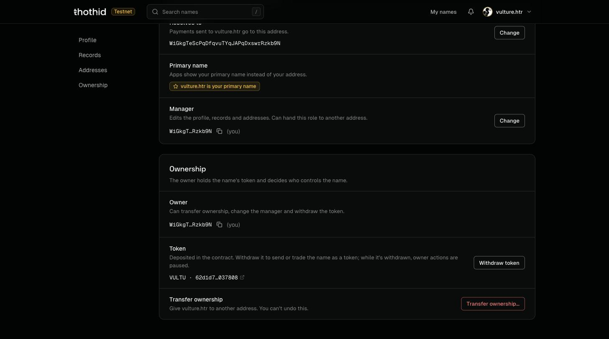
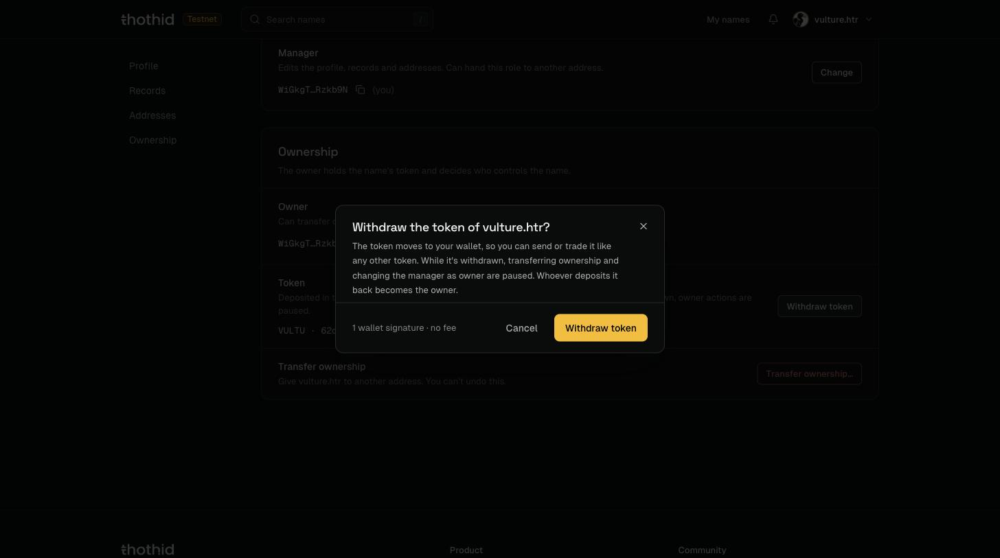
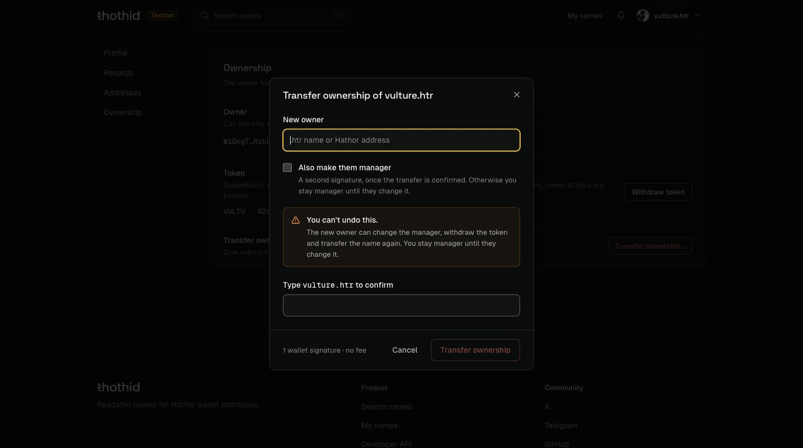

# Ownership

The **Ownership** section of [Manage mode](domain-page.md#manage-mode) is where control of a name lives: who owns it, where its token is, and how to hand it to someone else.

## The two roles

| Role        | Held by                                  | Can do                                                                                                                   |
| ----------- | ---------------------------------------- | ------------------------------------------------------------------------------------------------------------------------ |
| **Owner**   | The address that holds the name's token  | Transfer ownership, change the manager, withdraw and deposit the token                                                   |
| **Manager** | The address in charge of day-to-day use  | Edit the [profile](profile.md) and [records](records.md), change [where the name resolves to](addresses.md#resolves-to), set it as [primary name](addresses.md#primary-name), and hand the manager role on |

When you register a name you get both roles. They only diverge if you split them on purpose, for instance owning a name yourself while a teammate manages its profile. Note that the owner can't edit the profile or records directly; an owner who isn't the manager can [make themselves manager](addresses.md#manager) first.

The name appears in [**My names**](dashboard.md) for whoever is the _manager_.

## The name's token

Registering a name mints a **token** (an NFT) that represents it. The **Token** row shows its symbol and ID, with a link to the Hathor explorer.

### Deposited and withdrawn

The token can sit in one of two places.

**Deposited** (the default after registration): the contract holds the token. The owner is recorded in the contract and can transfer ownership and change the manager.

**Withdrawn**: the token is in a wallet. It behaves like any other Hathor token: you can hold it, send it, or sell it on a marketplace. While it's out, the contract can't confirm who the owner is, so owner actions are paused. The name page shows the address that withdrew it as **Last owner**.

* The **owner** sees **Withdraw token** while it's deposited. A dialog explains what withdrawing pauses; one wallet signature, no fee.
* While it's withdrawn, anyone sees **Deposit token**, in Manage mode and on the name's public page. There's no confirmation dialog.

**Depositing the token makes you the owner.** That is how selling a name works: send the token to the buyer, and when they deposit it back into the contract, ownership follows. If your wallet doesn't hold the token, the deposit fails and nothing changes.

## Transfer ownership

The owner sees **Transfer ownership…** at the bottom of the section. It opens a dialog:

1. Enter the **new owner**: an address or a `.htr` name (see [Entering an address](addresses.md#entering-an-address)).
2. If you're also the manager, you can tick **Also make them manager**. That adds a second signature, sent once the transfer is confirmed. Otherwise you stay manager until they change it.
3. **Type the name** to confirm, then click **Transfer ownership**.


Transferring ownership is final. There is no undo, and the new owner can change the manager, withdraw the token and transfer the name again. Check the address before you approve.


Transferring requires the token to be **deposited**. If it's withdrawn, deposit it first.
