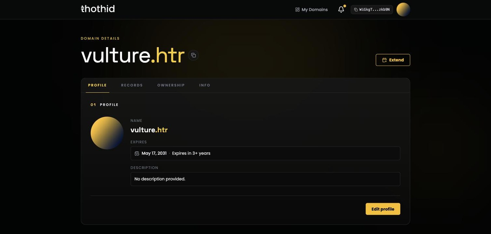
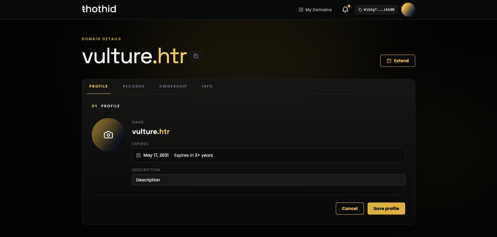

# Profile Tab

The Profile tab is the public face of a name: its avatar, when it expires, and a short description.

## What's shown

| Field           | Notes                                                                                           |
| --------------- | ----------------------------------------------------------------------------------------------- |
| **Avatar**      | The image at the `avatar_link` record. Falls back to a generated gradient when there isn't one. |
| **Name**        | The full name. A **Primary** tag appears if this is the manager's primary name.                 |
| **Expires**     | The exact date plus a plain-language countdown — _Feb 9, 2031 · Expires in 3+ years_.           |
| **Description** | The `description` record, or _No description provided._                                         |

The expiry box turns **yellow** in the last 30 days and **red** once the name has expired. See [Renew a Domain](renew.md).

## Changing the avatar

If you're the owner or manager, hover the avatar and a camera icon appears.

1. Click the avatar and pick an image — up to **5 MB**.
2. Crop it in the dialog that opens and confirm.
3. The image is uploaded, then your wallet asks you to sign one transaction writing the new URL into `avatar_link`.

The old image is cleaned up automatically once the new one confirms. If you reject the signature, the upload is rolled back and nothing changes.

## Editing the profile

**Edit profile** turns the description into an input and lets you swap the avatar at the same time — the camera icon stays on the avatar for as long as you're editing.

**Save profile** then submits **one transaction per changed field** — change both the description and the avatar and your wallet will prompt you twice, once for each. Changing nothing and saving just closes the editor.

Both fields are ordinary [records](records.md) under the hood, so the same limits apply: a description can be at most **200 characters**.

## Set a primary name

A wallet can hold many names, but only one is its **primary name** — the one thoth.id shows for your address everywhere: in the top bar, on avatars next to your address, and to anyone else looking up your profile.

The **first** name you register becomes your primary name automatically. After that you choose: if the name you're viewing isn't already primary and you manage it, a **Set primary** button appears next to _Edit profile_. Click it, sign the transaction, and the change takes effect once it confirms.

Setting a new primary name replaces the old one — there is only ever one per address.
