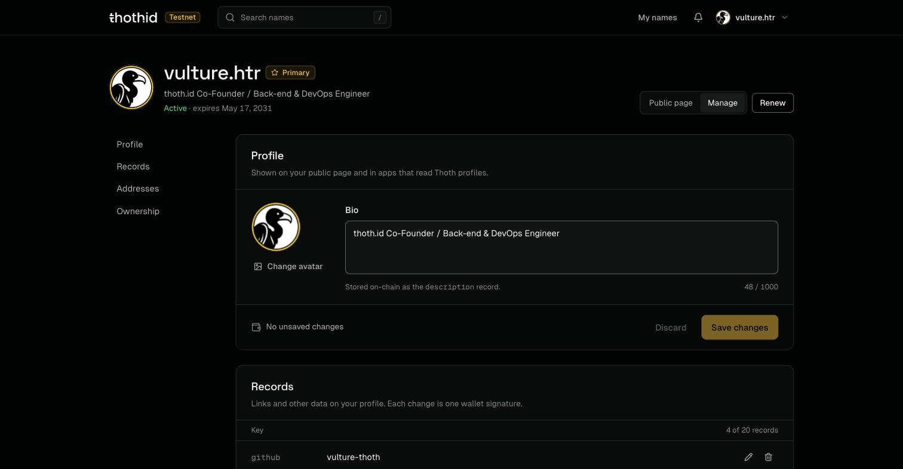

# Profile

The **Profile** section of [Manage mode](domain-page.md#manage-mode) sets the name's avatar and bio. They're shown on the name's public page, in the top bar for its manager, and in any app that reads thoth.id profiles.

Only the **manager** can edit the profile.

## Avatar

Click **Add avatar** (or **Change avatar**) and pick an image, up to **5 MB**. Crop it in the dialog that opens and confirm. The new image is marked **New** but nothing is sent yet; **Keep current avatar** throws it away.

When there's no avatar, the name's first letter is shown instead.

## Bio

A short line about you or your project. It's stored on-chain as the `description` [record](records.md), so the same limit applies: at most **200 characters**. A counter under the field shows how many you've used.

An empty bio can't be saved. To remove it, delete the `description` record under [Records](records.md).

## Saving

Nothing is sent until you click **Save changes**. The footer tells you how many signatures it will take:

* **1 wallet signature** if you changed one thing.
* **2 wallet signatures: bio first, then avatar** if you changed both. The avatar request follows once the bio is confirmed, with a **1 · Bio → 2 · Avatar** progress line.

**Discard** puts both fields back as they are on-chain.

When you replace an avatar, the old image is removed from storage once the new one confirms.
