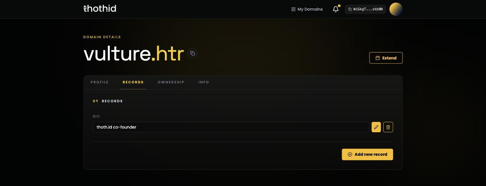

# Records Tab

Records are free-form **key/value pairs stored on-chain** with your name. Use them for anything you want to publish alongside your identity — a website, social handles, a contact address, an app-specific setting.

Above, a custom `bio` record — the pencil and bin buttons and **Add new record** appear because the connected wallet manages this name. A visitor sees the same record without them.

Two keys are special because the app itself reads them:

| Key           | Used by                                                                           |
| ------------- | --------------------------------------------------------------------------------- |
| `avatar_link` | The avatar shown on the [Profile tab](profile.md), the dashboard, and the top bar |
| `description` | The description on the [Profile tab](profile.md)                                  |

They are otherwise normal records — you can edit or delete them here just like any other.

## Viewing

Anyone can read the records of any name. Each record shows its key as a label and its value in a read-only field. Values whose key contains `url` or `link` get an external-link icon.

A name with no records reads _No custom records found for this domain._

## Adding a record

Available to the owner and the manager.

1. Click **Add new record**.
2. Fill in the key and the value.
3. **Save**, then approve the transaction in your wallet.

## Editing and deleting

Each row has two buttons:

* **Edit** — turns the value into an input; **Save** submits the change.
* **Delete** — removes the record.

Both are single on-chain transactions. Editing a record only changes its value; to rename a key, delete the old record and add a new one.

Deleting or replacing `avatar_link` also removes the stored image file, so a link you've shared elsewhere will stop working.

## Limits

These come from the nano contract, not the app:

| Limit                     | Value                                 |
| ------------------------- | ------------------------------------- |
| Records per name          | **20**                                |
| Key length                | 1–**50** characters                   |
| Key characters            | letters, numbers and underscores only |
| Value length              | 1–**200** characters                  |
| Total size of all records | 10,000 bytes                          |

Keys are case-sensitive, so `Website` and `website` are two different records. Sticking to lowercase keys makes life easier for anything reading your profile.

## Reading records from code

Anything you store here is readable through the SDK with [`getProfileData`](../sdk-reference/getProfileData.md), so records are the natural place to publish data you want other applications to pick up.
