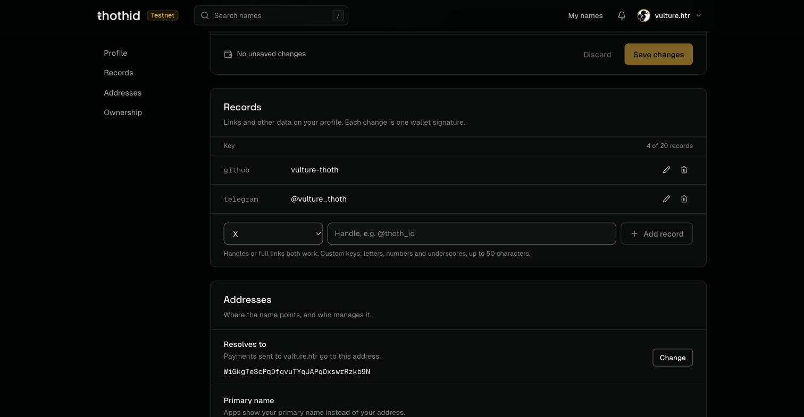

# Records

Records are **key/value pairs stored on-chain** with your name. Use them for anything you want to publish alongside your identity: your socials, a website, a contact address, an app-specific setting.

Anyone can read them in the **Links** panel of the name's [public page](domain-page.md#the-panels). The **manager** edits them in the **Records** section of [Manage mode](domain-page.md#manage-mode).

## Adding a record

1. Pick a type from the list: **X**, **GitHub**, **Telegram**, **Discord**, **Website**, **Email**, or **Custom key…**.
2. Type the value. Handles and full links both work: `@thoth_id` and `https://x.com/thoth_id` are both fine for X.
3. Click **Add record** and approve the transaction in Hathor Wallet.

The new record shows as **Pending** until it confirms.

A custom key can use letters, numbers and underscores, up to 50 characters, for example `pgp_fingerprint`. Keys are case-sensitive, so `Website` and `website` are two different records; sticking to lowercase makes life easier for anything reading your profile.

## Editing and deleting

Each row has two buttons:

* **Edit** (the pencil) turns the value into an input. **Save** sends the change.
* **Delete** (the bin) asks _Delete this record?_ in the row. Confirm with **Delete**.

Each change is one wallet signature. Editing changes only the value; to rename a key, delete the record and add a new one. While a change is confirming, the row is locked.

## How links are shown

On the public page, an X, GitHub or Telegram handle is turned into a link to that profile, a website gets `https://`, and an email opens the visitor's mail app. A value that's already a full link is used as it is. A Discord username has a copy button instead. Other keys appear under **Other records**.

## Special keys

Two keys are used by the app itself and are edited under [Profile](profile.md), not here:

| Key           | Used for                                                                            |
| ------------- | ----------------------------------------------------------------------------------- |
| `avatar_link` | The avatar on the name's page, in My names, and in the top bar                      |
| `description` | The bio                                                                             |

They still count toward the record limit.

## Limits

These come from the nano contract, not the app:

| Limit                     | Value                                 |
| ------------------------- | ------------------------------------- |
| Records per name          | **20**, including avatar and bio      |
| Key length                | 1–**50** characters                   |
| Key characters            | letters, numbers and underscores only |
| Value length              | 1–**200** characters                  |
| Total size of all records | 10,000 bytes                          |

The section header shows how many you've used, for example _3 of 20 records_.

## Reading records from code

Anything you store here is readable through the SDK with [`getProfileData`](../sdk-reference/getProfileData.md), so records are the natural place to publish data you want other applications to pick up.
