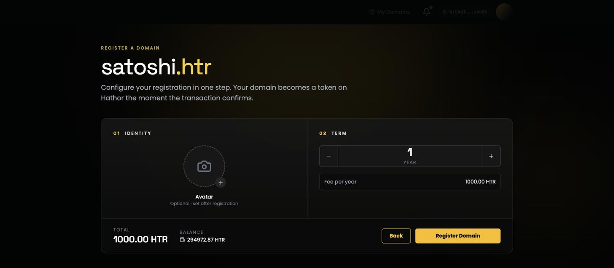

# Register a Domain

Registration happens on a single screen. You pick how long you want the name for, optionally choose an avatar, and sign one transaction.

You reach it by clicking an **Available** result on the [search page](search.md), or by going to `/register?domain=yourname.htr` directly.

## 01 · Identity — your avatar (optional)

Click the camera circle and choose **Upload image**.

* Any image format your browser can read, up to **5 MB**.
* A cropping dialog opens so you can frame the square that will be used.
* The cropped image is held in your browser until you submit, so a refresh won't lose it. Click the red ✕ on the preview to remove it.

**Search from Web** is listed in the menu but is not available yet.

You can skip this entirely and add an avatar later from the [Profile tab](profile.md) — the label under the circle says as much.

## 02 · Term — how many years

Use **−** and **+** to choose between **1 and 10 years**.

**Fee per year** is read live from the nano contract and depends on the length of the name — shorter names cost more. The figure in the screenshot is the current **testnet** fee; treat it as an example, not a price list. See [Naming Rules & Fees](naming-rules-and-fees.md#what-a-name-costs).

## The summary bar

At the bottom of the panel:

| Field       | Meaning                                  |
| ----------- | ---------------------------------------- |
| **Total**   | Fee per year × the number of years       |
| **Balance** | The HTR balance of your connected wallet |

If your balance is below the total, a red **Insufficient HTR balance** warning appears and the register button is disabled. Top the wallet up and the page picks up the new balance.

## Submitting

1. If you haven't connected yet, the button reads **Connect Wallet** — see [Connect Your Wallet](connect-wallet.md).
2. Once connected it reads **Register Domain**. Click it.
3. Your wallet asks you to approve the transaction. Review the deposit amount and confirm.
4. The button changes to **Submitted** with the transaction hash, and you're taken to your [dashboard](dashboard.md).

The name is **not yours until the transaction confirms**. Track it from the notification bell — see [Transactions & Notifications](https://docs.thoth.id/web-app/notifications).

## What registration actually does

* Creates the name entry in the thoth.id nano contract, with you as **owner**, **manager** and **resolving address**.
* If this is your **first** name, it automatically becomes your [primary name](profile.md#set-a-primary-name).
* Mints an **NFT token** representing the name, held by the contract (state: _Deposited_). The token symbol is the first five characters of the name, uppercased — so `satoshi.htr` gets the symbol `SATOS`.
* Sets the expiry date to the number of years you paid for.

## If you chose an avatar

The avatar can't be written until the name exists, so the app queues it. As soon as the registration confirms, the queued job runs on its own: it uploads the image, then asks you for **one more signature** to write the resulting URL into your profile's `avatar_link` record.

You'll see both steps in the notification centre — the second one sits in a _waiting_ state until the first succeeds.


Keep the tab open until the avatar step has asked for its signature. If you close it, the name is still registered — just set the avatar manually later from the [Profile tab](profile.md).


## Limits

One address can manage at most **100 names**.
