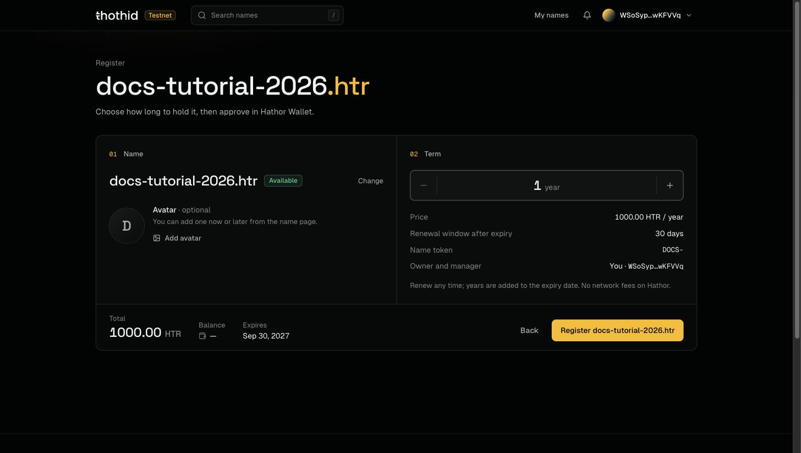

# Register a Name

Registration happens on a single screen. You pick how long you want the name for, optionally choose an avatar, and approve one transaction in Hathor Wallet.

You get there by clicking **Register** on an **Available** search result, from the **Register** button on an unregistered name's page, or by going to `/register?domain=yourname.htr` directly.

## 01 · Name

The name you're registering, with an **Available** pill. **Change** takes you back to search.

**Avatar · optional.** Click **Add avatar** and pick an image. A cropping dialog opens so you can frame the square that will be used. You can change or remove it before you register. The image is kept in your browser until you submit, so a reload won't lose it.

You can skip the avatar and add one later from [Manage mode](profile.md).

## 02 · Term

Use **−** and **+** to choose between **1 and 10 years**. Below the stepper:

| Row                             | Meaning                                                                                                  |
| ------------------------------- | -------------------------------------------------------------------------------------------------------- |
| **Price**                       | HTR per year, read live from the contract. It depends only on the length of the name.                    |
| **Renewal window after expiry** | How long after expiry the name can still only be renewed (30 days)                                       |
| **Name token**                  | The symbol of the token minted for the name: its first five characters, uppercased                       |
| **Owner and manager**           | You, with your address. Shown once your wallet is connected.                                             |

The price in the screenshots is the current **testnet** price; treat it as an example, not a price list. See [Naming Rules & Fees](naming-rules-and-fees.md#what-a-name-costs).

## The summary

At the bottom of the panel:

| Field       | Meaning                                                  |
| ----------- | -------------------------------------------------------- |
| **Total**   | Price per year × the number of years                     |
| **Balance** | The HTR balance of your connected wallet                 |
| **Expires** | The date the name would expire if you registered it now  |

If your balance is below the total, a **Not enough HTR** message says how much more you need and shows your address with a copy button, so you can top the wallet up. The register button stays disabled until you have enough.

If you chose an avatar, the summary also says **2 wallet signatures**: the name first, then the avatar once the name is confirmed.

## Submitting

1. If you haven't connected yet, the button reads **Connect wallet**. See [Connect Your Wallet](connect-wallet.md).
2. Once connected, it reads **Register yourname.htr**. Click it. The app checks one last time that nobody has registered the name in the meantime.
3. Hathor Wallet asks you to approve the transaction. Review the amount and confirm.
4. The panel shows the transaction's progress: **Confirming**, with a timer, then **yourname.htr is yours**.

You can stay on the page and watch, or leave: the transaction keeps being tracked under the bell. See [Transactions & Activity](notifications.md).

When it's confirmed, the panel offers **View yourname.htr** and **Register another**.

## What registration actually does

* Creates the name in the thoth.id contract, with you as **owner**, **manager** and the address the name **resolves to**.
* If this is your **first** name, it automatically becomes your [primary name](addresses.md#primary-name).
* Mints a **token** that represents the name, held by the contract (_Deposited_). Its symbol is the first five characters of the name, uppercased, so `satoshi.htr` gets `SATOS`.
* Sets the expiry date to the number of years you paid for.

## If you chose an avatar

The avatar can't be written until the name exists. As soon as the registration confirms, the app uploads the image and Hathor Wallet asks for a **second signature** to save it to your profile. This happens wherever you are in the app. The panel shows it as **Approve the avatar in Hathor Wallet · Signature 2 of 2**.

If you refuse that second request, or it expires, the name is still registered. Set the avatar later from [Manage mode](profile.md).

## Limits

One address can manage at most **100 names**.
