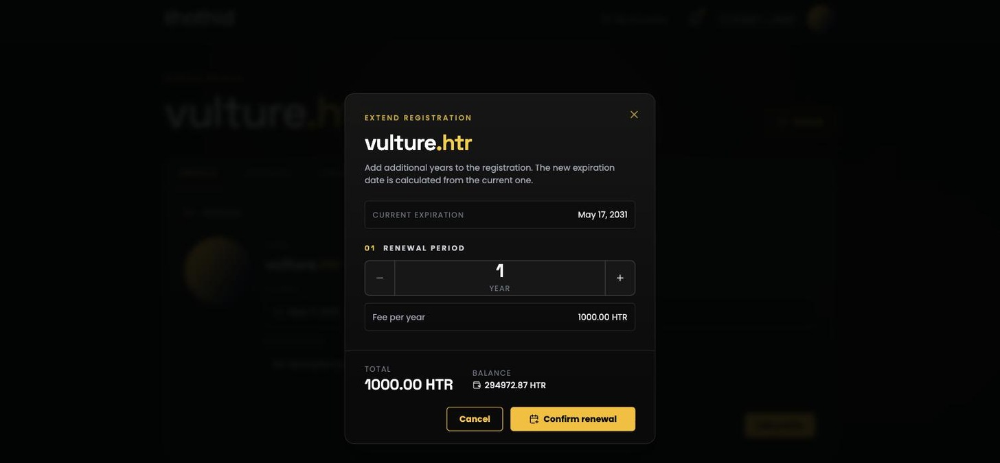

# Renew a Domain 🗓️

Registrations are for a fixed number of years. Renewing — the app calls it **extending** — adds more years before the name lapses.

Open the name's [domain page](domain-page.md) and click **Extend** in the header.

## The dialog

* **Current expiration** — the date you're extending from.
* **Renewal period** — how many years to add, from **1 to 10**.
* **Fee per year** — the same length-based fee as registration. See [Naming Rules & Fees](naming-rules-and-fees.md#what-a-name-costs).
* **Total** and **Balance** — as on the registration page; an insufficient balance disables the confirm button.

Click **Confirm renewal** and approve the transaction in your wallet. The new expiry date appears once it confirms.

## How the new date is calculated

Years are added to the **current expiry date**, not to today — renewing early never costs you the time you've already paid for.

The one exception is a name that has already expired. There, the years are counted from **now**, so the sooner you renew a lapsed name the better.

## Expiry and the grace period

When a name passes its expiry date it enters a **30-day grace period**. During the grace period:

* The name is still yours to renew.
* Nobody else can register it.

Once the grace period ends, the name is released and anyone can register it. There is no way to get it back at that point except by registering it again — if somebody else hasn't first.

The app warns you well ahead of that:

* The expiry pill on the [dashboard](dashboard.md) turns yellow inside the last 30 days and red once expired.
* The dashboard's summary bar counts your names **expiring soon**.
* The expiry box on the [Profile tab](profile.md) is colour-coded the same way.

## Anyone can renew a name

The contract does not require you to be the owner or manager to renew. If a friend's name is about to lapse, you can pay to extend it — the name stays theirs, you just cover the fee.
