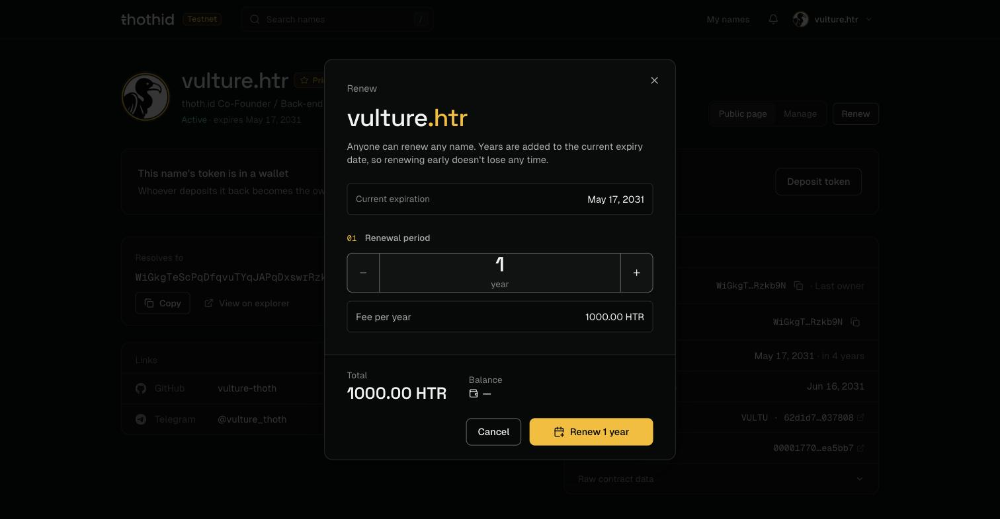

# Renew a Name

Registrations are for a fixed number of years. Renewing adds more years before the name lapses.

You can open the **Renew** dialog from:

* The **Renew** button on the name's page, if you're its owner or manager.
* The **Renew** button on a row in [My names](dashboard.md), which appears from 30 days before expiry.
* The page of an **expired** name, where **Renew** is available to everyone.

## The dialog

* **Current expiration**: the date you're renewing from.
* **Renewal period**: how many years to add, from **1 to 10**.
* **Fee per year**: the same length-based price as registration. See [Naming Rules & Fees](naming-rules-and-fees.md#what-a-name-costs).
* **Total** and **Balance**: as on the registration page. If your balance is too low, the dialog says so and the button is disabled.

Click **Renew 1 year** (or however many you chose) and approve the transaction in Hathor Wallet. The dialog shows the progress, and the new expiry date appears once it confirms.

## How the new date is calculated

Years are added to the **current expiry date**, not to today, so renewing early never costs you the time you've already paid for.

The exception is a name that has already expired. There, the years are counted from **now**, so the sooner you renew a lapsed name the better.

## Expiry and the renewal window

When a name passes its expiry date it stops resolving and enters a **30-day renewal window**. During the window:

* The name can still be renewed.
* Nobody can register it.

Once the window ends, the name is released and anyone can register it. There is no way to get it back at that point except by registering it again, if nobody else does first.

The app warns you well ahead of that:

* The expiry in [My names](dashboard.md) turns yellow in the last 30 days and red once expired, and a warning at the top counts the names that need renewal.
* The status line on the name's page reads **Expiring soon**, then **Expired**.

## Anyone can renew a name

The contract doesn't require you to be the owner or manager to renew. If a friend's name is about to lapse, you can pay to extend it. The name stays theirs; renewing doesn't change the owner.
