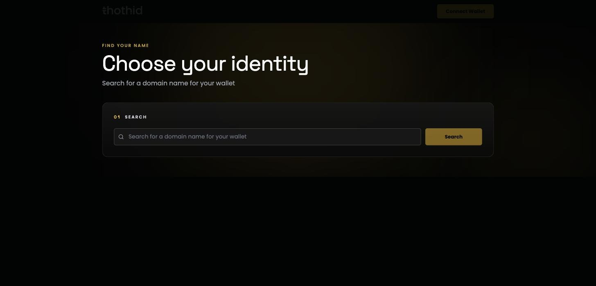
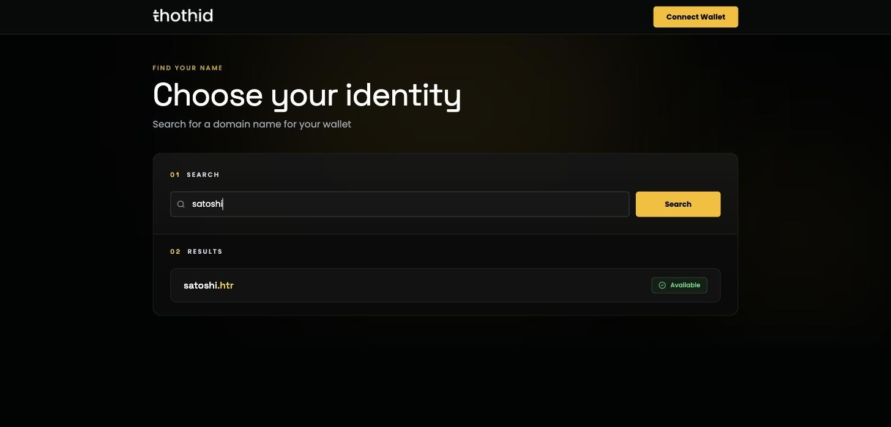
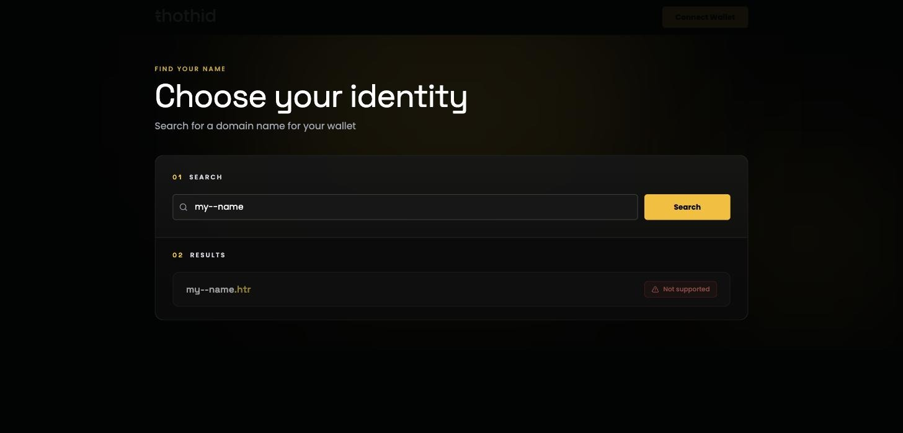

# Search for a Name

The search page tells you whether a name is free, already taken, or not a valid thoth.id name at all. You do **not** need a connected wallet to search.

Go to **/search**, or click the thoth.id logo while connected.

## Searching

Type the name you want and press **Enter** or click **Search**. You can leave the suffix off — `satoshi` and `satoshi.htr` are the same query. Input is lowercased and trimmed automatically, so `Satoshi` still finds `satoshi.htr`.

The search term is kept in the URL (`/search?q=satoshi`), so a result is a link you can bookmark or send to somebody.

## Reading the result

You get exactly one result, with one of three status pills.

### Available

Nobody holds this name. Click the row to go straight to [registration](register.md).

### Registered

Somebody already holds it. Click the row to open its [public domain page](https://docs.thoth.id/web-app/domain-page), where you can see who controls it and when it expires.

A registered name is not necessarily taken forever — names expire. If the expiry date has passed and the 30-day [grace period](naming-rules-and-fees.md#expiry-and-the-grace-period) is over, the name becomes available again.

### Not supported

The name breaks the [naming rules](https://docs.thoth.id/web-app/naming-rules-and-fees#what-makes-a-valid-name) — it is too short or too long, contains characters that aren't allowed, or misuses hyphens. The row is greyed out and can't be clicked.

In the example above, `my--name` is rejected because thoth.id doesn't allow two hyphens in a row. `my-name` would be fine.

> The same status appears if the availability check itself fails — for example if the Hathor node can't be reached. If a name you expect to be valid comes back as _Not supported_, try the search again.

## Searching from the dashboard

The [dashboard](dashboard.md) has its own search box. It filters the names you already control first, and only falls back to an on-chain availability check when nothing in your own list matches.
