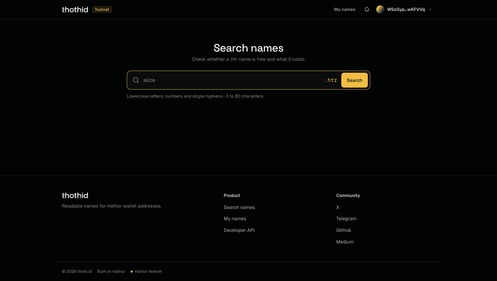
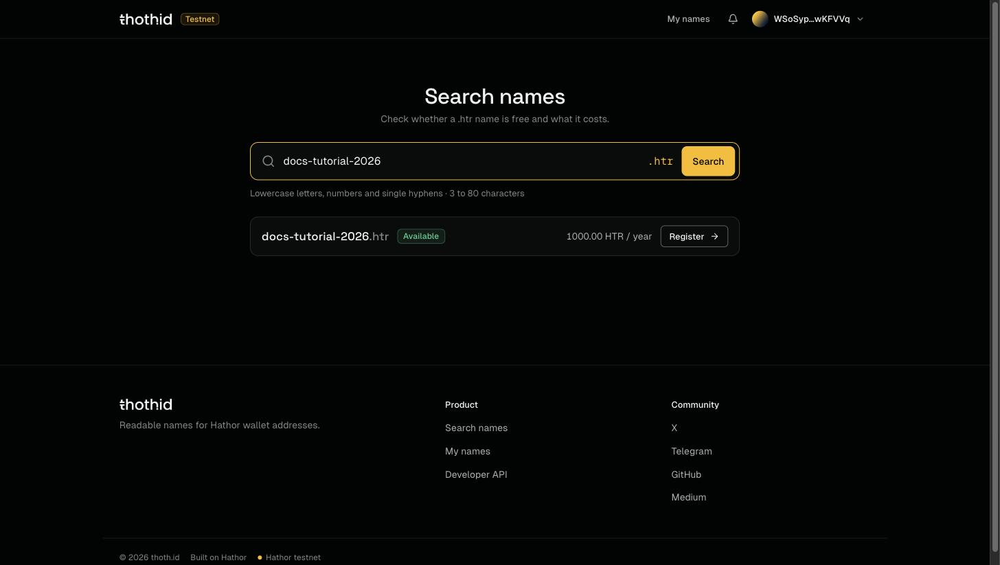
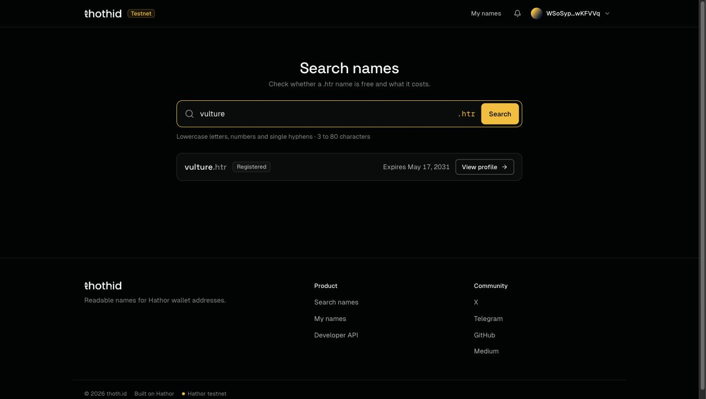
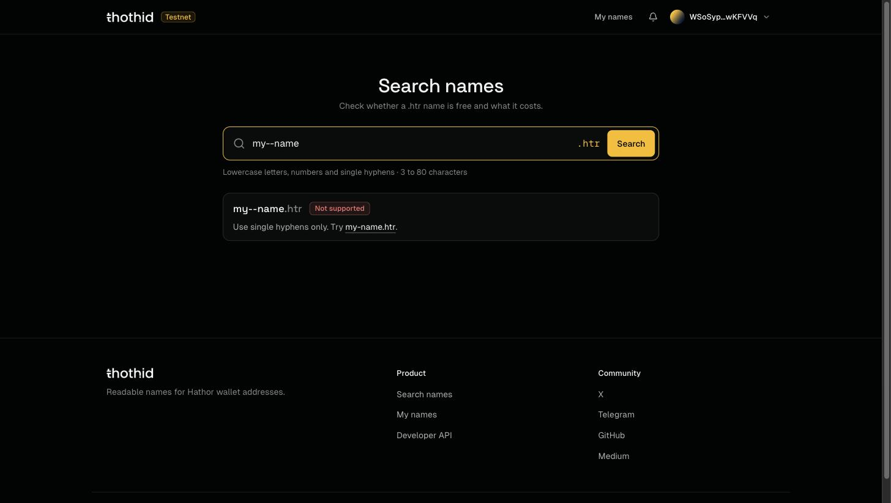

# Search for a Name

Search tells you whether a name is free, what it costs, or who already holds it. You do **not** need a connected wallet to search.

There are three places to search:

* The **search page** at **/search**.
* The **hero** on the landing page.
* The **search box in the top bar**. Press <kbd>/</kbd> anywhere to jump to it. On a phone, tap the magnifying glass.

## Searching

Start typing. The result appears **as you type**, no need to press Enter. You can leave the `.htr` suffix off: `satoshi` and `satoshi.htr` are the same query. Input is lowercased and trimmed, so `Satoshi` still finds `satoshi.htr`.

The line under the field sums up the rules: lowercase letters, numbers and single hyphens, 3 to 80 characters. The full rules are in [Naming Rules & Fees](naming-rules-and-fees.md#what-makes-a-valid-name).

The search term is kept in the URL (`/search?q=satoshi`), so a result is a link you can bookmark or send to somebody.

## Reading the result

You get one result row, with one of these status pills.

### Available

Nobody holds this name. The row shows its price per year and a **Register** button that takes you to [registration](register.md).

### Registered

Somebody already holds it. The row shows when it expires and a **View profile** button that opens its [public page](domain-page.md).

A registered name is not taken forever. Names expire, and once the [renewal window](naming-rules-and-fees.md#expiry-and-the-renewal-window) is over, the name becomes available again.

### Expired

The name has expired but is still in its **renewal window**. The row shows the date the window ends. Until then only a renewal is possible; after that, anyone can register it.

### Not supported

The name breaks the naming rules. The row says exactly what's wrong (for example _Spaces aren't allowed._ or _Use lowercase letters._) and, when it can, suggests a valid name close to what you typed. Click the suggestion to search for it.

In the example above, `my--name` is rejected because thoth.id doesn't allow two hyphens in a row, and the app suggests `my-name` instead.

### Couldn't check

The app couldn't reach the Hathor node, so it doesn't know yet. This is **not** the same as _Not supported_. Click **Try again**.
